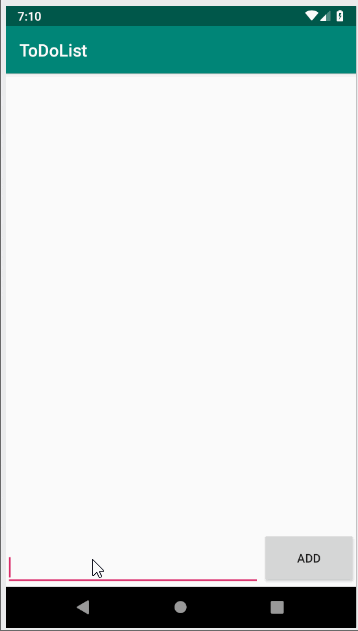

# *Simple Todo Application for Android*

**Simple Todo** is an Android app that allows building a to-do list and basic to-do items management functionality including adding new items, and editing and deleting an existing item.

## User Stories

The following **required** functionality is completed:

* [x] User can **view a list of todo items**
* [x] User can **successfully add and remove items** from the todo list
* [x] User's **list of items persisted** upon modification and and retrieved properly on app restart

## Video Walkthrough

Here's a walkthrough of implemented user stories:

GIF created with [LiceCap](http://www.cockos.com/licecap/).
